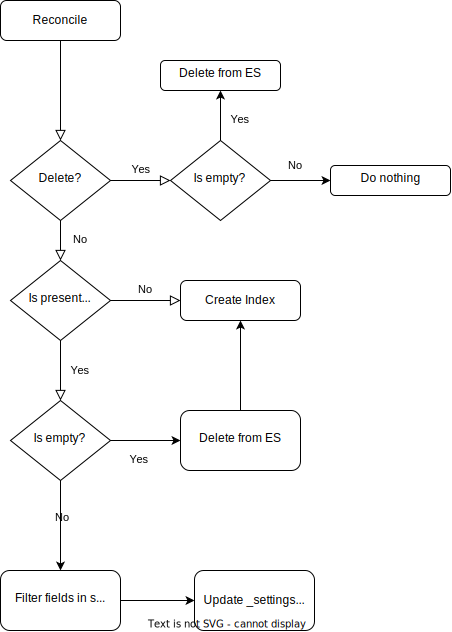

# Index (indices.es.eck.github.com)

Represents the Index in Elasticsearch cluster.

## Lifecycle
Because some fields are not modifiable after the index is created, 
the lifecycle for Index has to cope with it. 

There is one caveat, if the Index already exists in Elasticsearch
(e.g. it is updated), and it is not empty (`/_count` response > 0),
there is only a subset of fields from `settings` applied. This subset
currently contains:
- `number_of_replicas`
- `refresh_interval`

All other fields from `settings` are ignored, thus it can lead to 
an inconsistency between Index object in K8s and Index in Elasticsearch.

Mappings are applied as a whole, however, sometimes Elasticsearch rejects
such an update (for example when changing field type). These errors
are logged into the object events, so running 
`kubectl describe Index my-index` will give you an insight what is happening.



## Fields

| Key                             | Type   | Description                                                                                     |
|---------------------------------|--------|-------------------------------------------------------------------------------------------------|
| `metadata.name`                 | string | Name of the Index                                                                               |
| `spec.body`                     | string | Index definition - similar to one you would use when creating index using ES REST API           |
| `spec.dependsOn.indexTemplates` | list | List of index templates that have to be present in ES cluster before index is created / updated |
| `spec.dependsOn.indices`        | list | List of indices that have to be present in ES cluster before index created / updated            |

## Example
```yaml
apiVersion: es.eck.github.com/v1alpha1
kind: Index
metadata:
  name: index-sample
spec:
  dependsOn:
    indexTemplates:
      - indexTemplateName: indextemplate-sample
    indices:
      - indexName: index-base-sample
  body: |
    {
      "settings": {
        "number_of_shards": 1,
        "number_of_replicas": 0
      },
      "mappings": {
          "properties": {
            "field1": { "type": "text" }
          }
      },
      "aliases": {
          "index-sample-alias": {}
      }
    }
```
